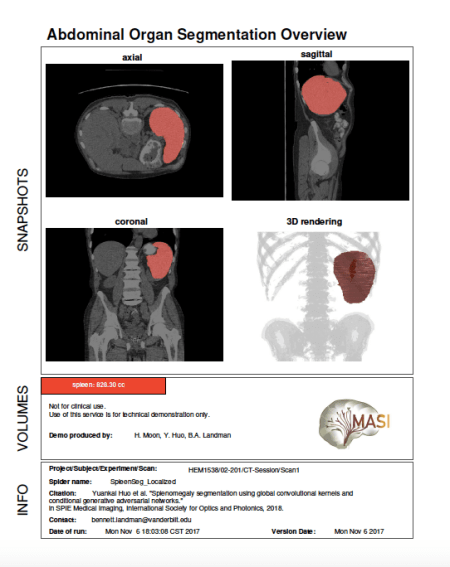

# *DeepSpleen*

Clinical trial data management pipeline using deep learning

--------------------------------------------------------------------------------------------------------------

## *General procedures*
##### **Data Uploading & Storage**
(Optional Process for storage)
1. Getting Dicom clinical trial files
2. Automated dicom push access to xnat server 
3. Quality assurance for purposes

##### **Preprocessing**
4. Image resampling, format converting with preprocessing

     [preprocessing](https://github.com/moonh1/DeepSpleen/tree/master/matlab/prepro_spleen)

##### **Segmentation**
5. Running 'segmentation' using Convolutional neural network

     [Segmentation](https://github.com/moonh1/DeepSpleen/tree/master/extra/python)

##### **Postprocessing & Making PDF Views**
6. Resampling into original dimension, postprocessing afterwards

     [postprocessing](https://github.com/moonh1/DeepSpleen/tree/master/matlab/postpro_spleen)
  
7. Show PDF file for demonstration

     [pdfprocessing](https://github.com/moonh1/DeepSpleen/tree/master/matlab/makepdf_spleen)

# CODES in PATHS
## Data Uploading
send_disk bash script is an initial function for transferring dicom image to XNAT.
send_disk also includes process for commenting dicom header with 'Patient Comments' field for locating XNAT project directory. Data uploading process and overall pipeline are not exactly connected, so it needs to be improved as one combined procedure in the future. Python function comment.py and storescu.py are for this process.

## Python
In Python folder, there are codes for training and validation.
The test set should be provided by own user, and trainging set is not necessary if you only want to get the segmentation result.
Eventually, you can get the segmented result images from the functions in it.

## fun_for_prepostProcessing
In fun_for_prepostProcessing folder, there are two kinds of functions.
1. Pre-processing functions.
  - For training the data, you need to resample the original testsets according to the Network and trained model that you       want to use. Since every network has different dimensions of models, you have to make a function that deals with the         process.
    Besides, importantly, the input data going into segmentation function should be 2D images. So you can slice 3D nii files     into 2D images. (Both training and test set)

2. Post-processing functions.
  - After having segmentation result, we have to check wheter segmentation has been conducted well or not. For this, Post-       processing functions will play a role. You can get the final segmentation 3D nii files whose dimensions are exactly same     as very-original files. The number of views you used will be merged into one 3D rengering image. If the segmentation was     done perfectly, when you overlay the result nii files on the original nii files, you could see the segmented organ on       the correct field of abdomen.

## fun_for_pdf
This folder has functions that are being used when we make up the pdf file for analysis.
Using functions in this directory, you will be able to get pdf files that show axial, coronal, saggital and 3D rendering views of merged segmentation results. Result pdf documents will also give you the volume size of each organ with 'cc' unit.
This can not be used for clinical purpose. This is only for the tecnical demonstration.

# Sample Output PDF

(Optional:) whole body segmentation: [pdfview_2.1.pdf](https://github.com/moonh1/Abdomen_seg_Pipeline/files/1584726/pdfview_2.1.pdf)

# History
- ver 1.0.1 (Uploaded Dec 11, 2017)
  - [x] Manual XNAT access 
  - [x] separated function calls and results

- ver 1.0.2 (Uploaded Jan 18, 2018)
  - [x] Added docker image to merge whole process
  - [x] Spltted pre & post processing functions
  - [x] No more need to install packages (Only have to build docker)
